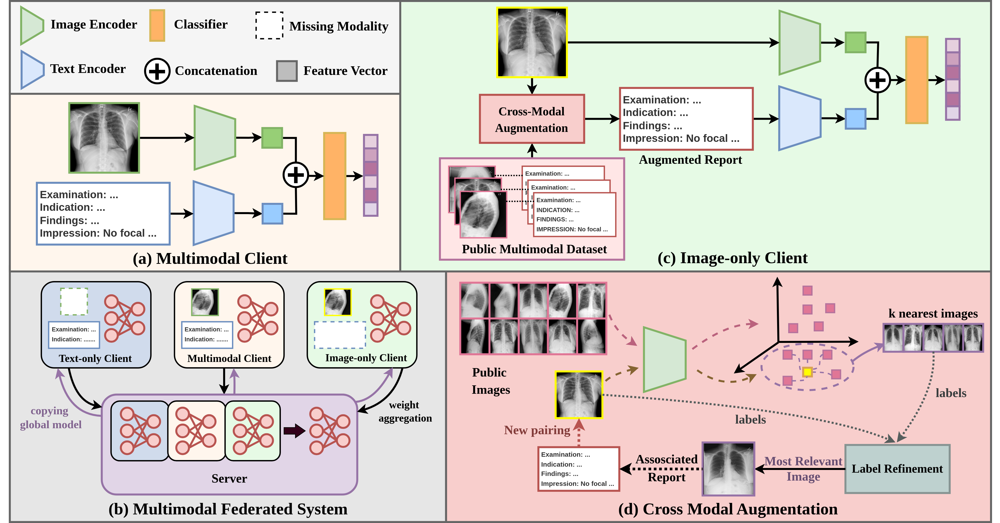

# CAR-MFL: Cross-Modal Augmentation by Retrieval for Multimodal Federated Learning with Missing Modalities

This repo contains a PyTorch implementation of the paper [CAR-MFL: Cross-Modal Augmentation by Retrieval for Multimodal Federated Learning with Missing Modalities](https://arxiv.org/abs/2302.08888) (MICCAI 2024). 

**<font color='red'>Note: This repository will be updated in the next few days for improved readability, easier environment setup, and datasets management</font> Please stay tuned!**



Illustration of <b>CAR-MFL</b>: <b>(a)</b> Multimodal client with access to multimodal data. <b>(b)</b> Multimodal federated system with missing modality. <b>(c)</b> Image client with only image samples; missing text modality is retrieved via our Cross-Modal Augmentation module. <b>(d)</b> Cross-Modal augmentation procedure for a query image (yellow): 
    Most relevant image from public data is retrieved based on distance in feature space and label similarity. Then, the associated text of the retrieved image is paired with the query image forming a paired input.

## Setup
This branch contains the code for homoegenous setup. For hetergenous setup, refer to Hetergenous branch.<font color = 'red'> Heterogenous Setup will be updated soon </font>

### Environment

The required packages of the environment we used to conduct experiments are listed in `environment.yml`.

### Datasets

For datasets, please download the MIMIC-CXR-JPG and resize all of the image into 256x256. Preprocessed annotations can be accessed [here](https://naamii-my.sharepoint.com/:f:/g/personal/pranav_poudel_naamii_org_np/Emc1xrBDA9VHnx-P_t_oe-8BDcZ5WF4Ow-6ZUo5aOOZgrg).<br>Please, be informed that dataloader load images from relative path stored in dictionary of preprocessed annotations, so you may need to modify the relative path accordingly. However, to ensure reproducibility, please do not change the order of data items in the annotations, as data mappings for clients are done accordingly. 
## Usage

To reproduce CAR-FML with 8 image only clients  run the following shell command:

```shell
python main.py --name $EXP_NAME  --algorithm fedavgRAG  --exp_dir $OUTPUT_DIR --seed $SEED --num_clients 4 --img_clients 6 --txt_clients 0 --alpha 0.3 --server_config_path configs/fedavgin_server.yaml --client_config_path configs/client_configs.yaml --use_refinement
```
where,
- num_clients = No. of Multimodal Clients
- img_clients = NO. of Unimodal Image Clients
- txt_clients = NO. of Unimodal Text Clients


## Citation

If you find the paper provides some insights into multimodal FL or our code useful 🤗, please consider citing:

```


```

## Acknowledgements

We would like to thank for the code from [CreamFL](https://github.com/FLAIR-THU/CreamFL) repository.